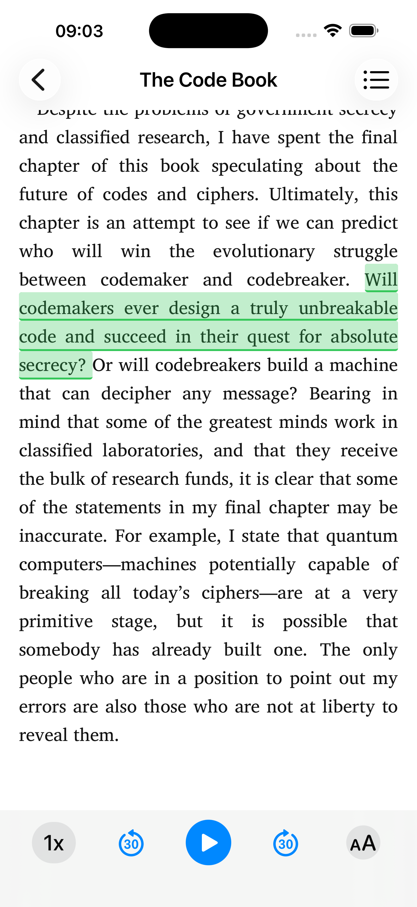
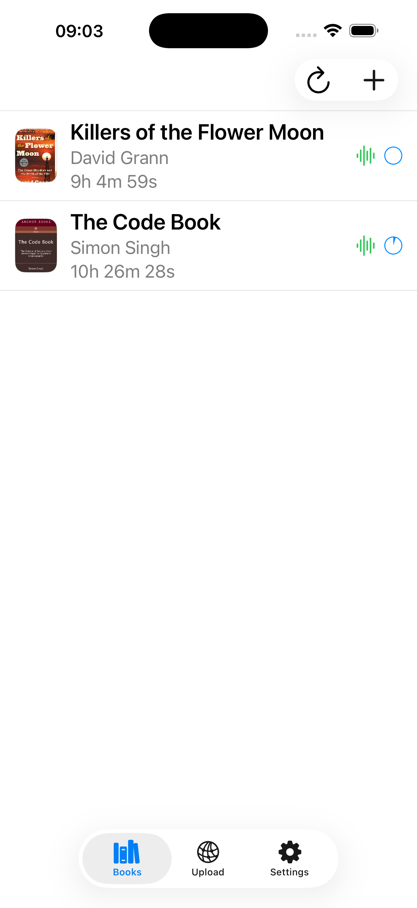
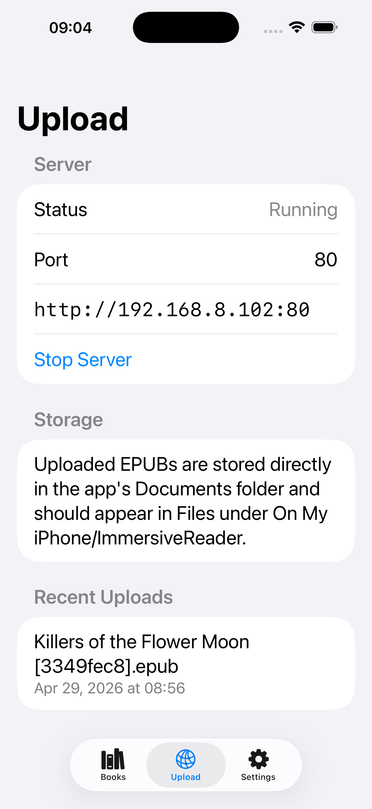
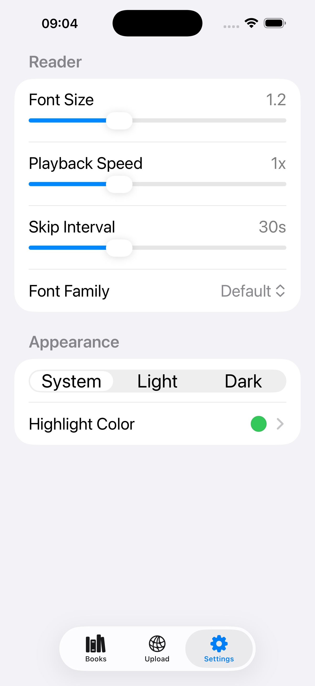

# ImmersiveReader

ImmersiveReader is an iOS/iPadOS EPUB reader built with SwiftUI, SwiftData, and Readium.

It focuses on EPUB3 reading with synced read-aloud playback, active text highlighting, upload/import workflows, reading progress restore, chapter navigation, reader appearance controls, and resume-aware playback.

## Screenshots

| Reader | Library | Upload | Settings |
| --- | --- | --- | --- |
|  |  |  |  |

## Features

- EPUB import from Files
- Local network upload server for `.epub` files
- SwiftData-backed library management
- Readium-based EPUB rendering
- Reading progress persistence and restore
- EPUB metadata and cover extraction
- EPUB3 media overlay parsing
- Read-aloud playback with active text highlighting
- Customizable highlight color
- Chapter drawer navigation
- Tap-to-play on spoken text
- Scroll-stop retargeting to the visible spoken line
- Reader font size, font family, and line height settings
- App theme selection: System, Light, or Dark
- Resume the last played audio segment for each book
- Files app exposure for imported EPUBs

## App Structure

The app has three tabs:

- `Books`: browse, import, refresh, delete, and open books
- `Upload`: run a local upload server and manage uploaded books
- `Settings`: reader typography, theme, and highlight color settings

## Reader Behavior

- Reader opens in scroll mode by default
- Playback bar appears only for books with parsed media overlays
- Active spoken text is highlighted in the EPUB view
- The highlight color can be customized from Settings
- Chapter selection can jump playback to the first matching clip
- Manual scroll-and-stop can retarget playback to the first visible playable fragment
- Reopening a book with a saved last-played segment navigates to that segment and highlights it without autoplay
- Reopening a book with no saved played segment does not pre-highlight any text

## Storage Layout

- Imported EPUB files are stored in the app `Documents` directory
- Temporary uploads are stored in `tmp/Immersive Reader/Uploads/`
- Extracted EPUB contents are stored in `Library/Application Support/Immersive Reader/Extracted/<book-id>/`

Imported EPUBs are intended to appear in the Files app under `On My iPhone/ImmersiveReader`.

## Tech Stack

- SwiftUI
- SwiftData
- Readium Swift Toolkit
- AVFoundation
- Network.framework

## Build

Open the Xcode project:

- `Immersive Reader.xcodeproj`

Or build from the command line:

```bash
xcodebuild -project "Immersive Reader.xcodeproj" -scheme "Immersive Reader" -destination 'generic/platform=iOS Simulator' build
```

## Notes

- The upload server is intended for devices on the same local network.
- Upload accepts only `.epub` files.
- Read-aloud features depend on EPUB media overlays being present and parsed successfully.
- Readium scroll mode in this setup is per-resource rather than a fully stitched whole-book vertical scroll.
